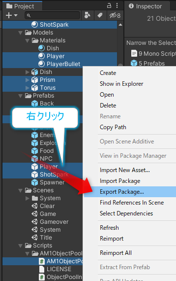
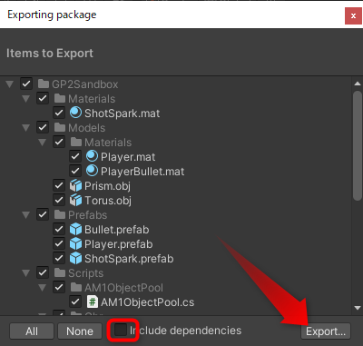

# 通常メンバーの作業

GitHub担当者以外のプログラマーの作業の流れです。

- Unityプロジェクトを入手する
- 開発する
- unitypackageをエクスポートする
- 最新のプロジェクトに更新する

## Unityプロジェクトを入手する

GitHub担当者の準備を先に完了してもらい、チーム用のUnityプロジェクトがGitHubにアップロードされて、そのリポジトリーのメンバーに加えられた状態から作業を開始します。

1. GitHub Desktopを起動して、自分のアカウントでサインイン
1. Fileメニューから Clone repository を選択
1. Filter your repositories 欄にUnityのプロジェクトフォルダー名を入力
1. プロジェクトが見つかったらクリックして選択
1. Local path 欄の Choose をクリックして、ドキュメント > 自分のフォルダーの下の任意の場所を選択
1. Cloneをクリック

以上で、5番目で指定した場所にリポジトリーのフォルダーがクローンされます。

## 開発する
開発する時は、mainやdevとは別に自分専用のブランチを作成して作業します。

- 元のブランチは通常は main
- ブランチ名は半角英数で `dev_自分の名前` など(例 `dev_tanaka`)

開発の際の注意点は以下の通りです。

- 成果物はシーンか Prefab にまとめる
- シーンとPrefab、Projectウィンドウにあるアセットは、作業をする担当者を決めて、原則として担当者以外は変更しないようにする
- 担当者以外が開発の都合で上記のものに変更する必要がある場合は、自分の名前を半角英数で加えたものを複製して、複製したものを使って開発する
- Player設定やレイヤー、タグの設定などの Project Settings 関連設定は、GitHub担当者が設定して、GitHubで共有する

## 完成したものを統合する

作業が完了したら、それをGitHub担当者のプロジェクトに統合してもらうためのUnityパッケージをエクスポートします。

1. Projectウィンドウで、作業をまとめたシーンか Prefab を右クリック
1. Select Dependencies をクリックして、必要なファイルを選択

3. 選択されたアセットのどれか一つを右クリックして、 Export Package... をクリック

4. Include dependencies のチェックを外して、Exportをクリック

5. ネットドライブのUnityパッケージを共有するフォルダーを選択して、プレハブ名で保存

以上でUnityパッケージの保存完了です。GitHub担当者に知らせて、インポートしてもらってください。

## プロジェクトを最新の状態に更新する

他のメンバーの作業をマージした最新の main で作業をしたい場合は、以下の方法が考えられます。

1. main ブランチを自分の作業用ブランチにマージする
1. main ブランチから新しい作業用のブランチを作成する

コンフリクトなどの問題が発生しないのであれば1の方法でよさそうです。マージに問題が発生したり、作業用のプロジェクトが荒れてしまって綺麗な状態に戻したいような時は新しくブランチを作成すればよいでしょう。

---

- [GitHub練習](./github_practice.md)へ
- [GitHub担当者の開発の流れ](./lead_dev.md)へ
- [README.md](../README.md)へ
