# チーム開発の準備

チーム開発に向けたGitの機能を練習します。

## ブランチ
Gitはオープンソースプロジェクトの開発を想定したツールです。リポジトリーを公開して、常に誰からアクセスされても構わないようにしておくのが基本です。

開発途中で作業時間が終わった場合に、そのままコミットとプッシュをすると、エラーがでるような状態のプロジェクトになってしまいます。これだとそのプロジェクトを使ってみたい人にとっては不便です。かといって、エラーがでない状態になるまでプッシュができないというのも不便です。

そこで、バージョン管理システムには**ブランチ**というものが用意されています。日本語で **枝** のことで、リポジトリーを枝分かれさせて、複数の状態を同時に保存できるようにするものです。

最初に割り当てられる**main** (以前は **master** )ブランチは、常に動作可能な状態にしておくのが一般的です。開発をする時にはmainから開発用のブランチを作成して、その開発用のブランチにコミットやプッシュをします。ブランチは独立しているのでmainブランチは動作する状態が維持されます。

開発が一段落して問題なく動作するようになったら、開発用ブランチをmainブランチに **マージ(=merge 結合)** します。これでmainブランチは常に動作する状態に保つことができます。開発を続行する時は、先の開発用ブランチで再び作業をするか、新しい開発用のブランチを作成して作業します。

理解を深めるために、実際に操作をしてみましょう。

### ブランチを作る
開発用のブランチ`dev`を作成してみます。ブランチを切り替える操作をする際には、以下の2点に注意してください。

- ブランチの操作をする前に、変更中のファイルを0にします
- ブランチの切り替え操作中は、Unityに切り替えないでください

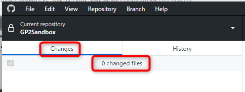

変更中のファイルがある状態でブランチを切り替えると状態の把握が難しくなります。作業中のファイルならコミット、変更を破棄して構わないならDiscardをしましょう。

ここでは何も変更をしていないはずなので、ChangesにファイルがあったらDiscard Allで変更を戻しておいてください。

1. GitHub Desktopに切り替えて、Current branchをクリック > Filter 欄に`dev`と入力 > Create New branch ボタンを押します

2. 続けて Create branch ボタンを押します

これで開発用のブランチ`dev`ができました。少し変更を加えてみます。

1. Unityに切り替えて、Projectウィンドウから GP2Sandbox > Scenes フォルダーを開いて、 System シーンをダブルクリックして開きます
1. Hierarchyウィンドウの + をクリックして、3D Object > Sphereを選んで球体を作ります
1. Fileメニューから Save を選択して保存します
1. GitHub Desktopに切り替えて、Summary欄に`Sphereを作成`などと入力してコミットします

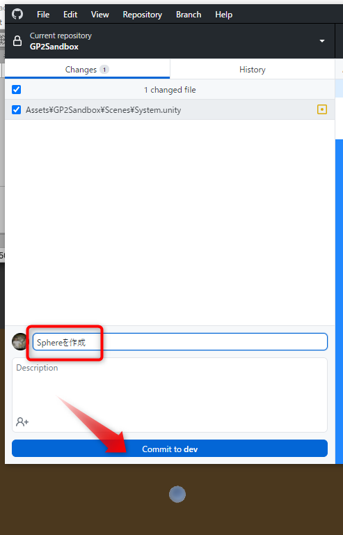

以上でdevブランチに変更を加えてコミットしました。それではmainブランチに切り替えてみます。

1. GitHub DesktopのCurrent branchをクリックして main を選択します

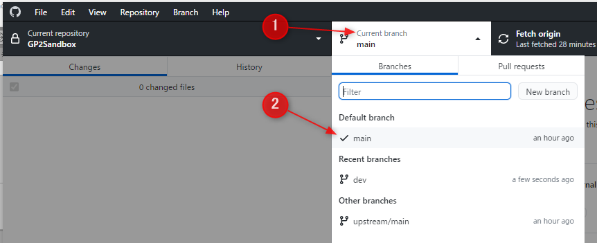

2. Unityに切り替えてReloadをクリックします

mainブランチはdevブランチを作成した時点の状態のままなので、先ほど作成したSphereがなくなって元の状態に戻ったことが確認できます。

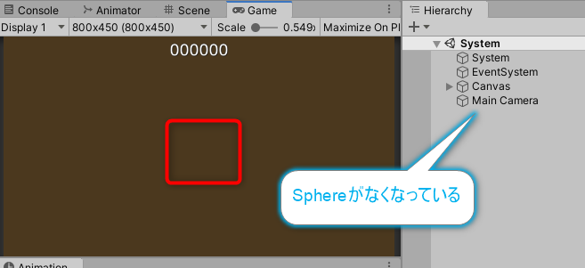

同様の操作でdevブランチに戻してみましょう。

1. GitHub DesktopのCurrent branchをクリックして dev を選択します
1. Unityに切り替えて、Reloadをクリックします

Sphereが復活します。

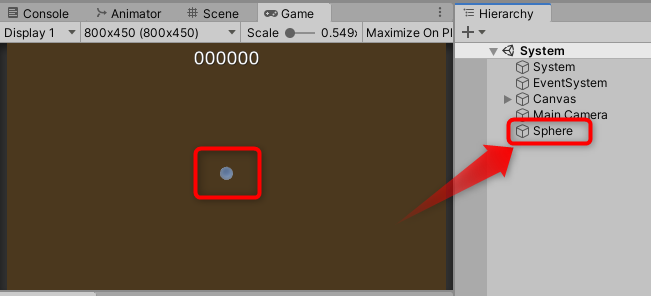

このようにブランチを利用すると、プロジェクトの様々な状態を同時に保存することができます。**ファイルを変更したままブランチを切り替えない限り**、マージするまでは他のブランチを破壊することはありません。

この性質を利用して、常にリポジトリーのmainブランチを実行可能な状態に保ったり、複数のメンバーが別々にプロジェクトの開発を進めることができます。

## マージ

開発が一段落して動作可能な状態になったら、開発ブランチで行った作業をmainブランチに結合します。これを **マージ(Merge)** と呼びます。

devで追加したSphereを、mainブランチにも反映させてみます。マージは **マージ先のブランチに切り替えて、マージ元のブランチを指定** します。

1. GitHub DesktopのCurrent branchを、**マージ先**であるmainに切り替えます
1. ブランチの切り替えが完了したら、Unityを選択してReloadして変更を反映させます
1. GitHub Desktopに切り替えて、Current branchをクリックして、一番下の Choose a branch to merge into main をクリックします

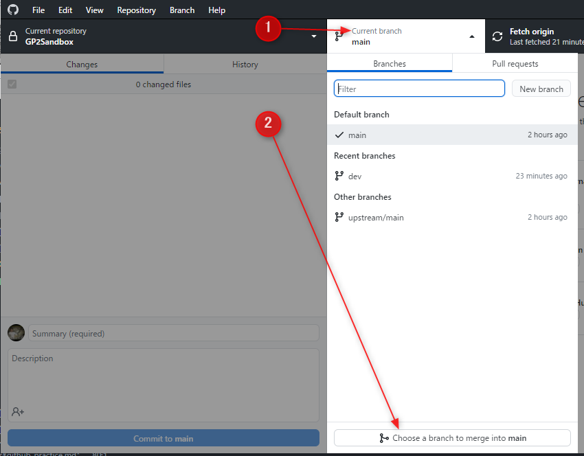

4. マージ元のdevブランチをクリックして選択して、 Merge dev into main をクリックします

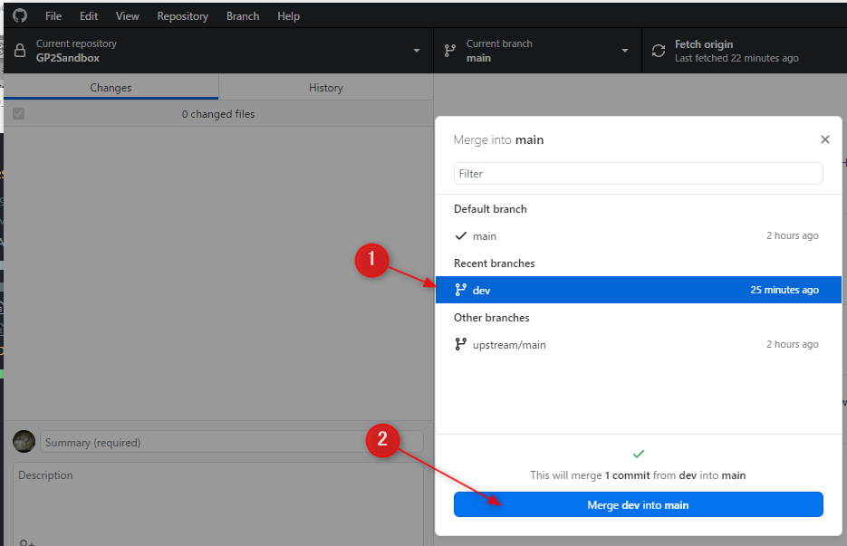

以上でマージ完了です。Unityに切り替えてReloadをしてください。mainブランチにもSphereが追加されます。Push origin すればGitHubにも更新が反映します。

一人で開発するなら、以上でmainを動作する状態に保ったまま開発が進められます。

## 簡易的なチーム開発

ブランチの作成方法とマージの仕方が分かりました。チームメンバーを共同開発者にして、メンバーそれぞれが自分の作業用のブランチを作って、そこで作業して、mainブランチにマージをすれば共同開発ができそうです。試してみましょう。

### シナリオ

以下のようなシナリオを考えます。

- AさんとBさんが同時に開発します
- Aさんは`dev`、Bさんは`devB`ブランチで作業をします
- Aさんは、SphereをGameシーンに移して、配置する作業を担当します
- Bさんは、GameシーンにCubeを作成して、配置する作業を担当します

AさんとBさんの両役になって作業を進めてみましょう。

### 作業手順

作業を開始する前にBさん用のブランチBを作成します。

1. GitHub Desktopで main ブランチに切り替えます
1. `dev`ブランチを作成したのと同様の手順で、`devB`ブランチを作成します

AさんとBさんが同じ状態から作業を開始する環境が整いました。まずはAさんの作業をします。

1. GitHub Desktopでdevブランチに切り替えます
1. Unityに切り替えます
1. Projectウィンドウの GP2Sandbox/Scenes フォルダーから Game シーンをHierarchyウィンドウにドラッグ&ドロップします
1. Hierarchyウィンドウで、Systemシーンに作成したSphereをドラッグして、Gameシーンに移動します

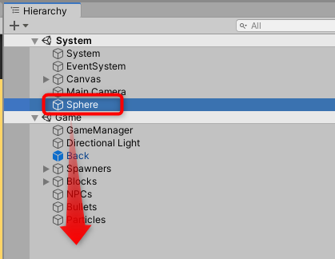

5. SphereをX=`2`, Y=`0`, Z=`2` あたりに移動します(実際はどこでもいいです)

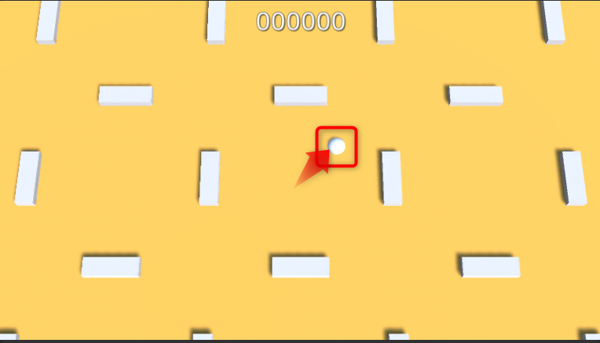

6. FileメニューからSaveでシーンを保存します
1. GitHub Desktopに切り替えます
1. Summaryに`Sphereを配置`など入力してコミットします

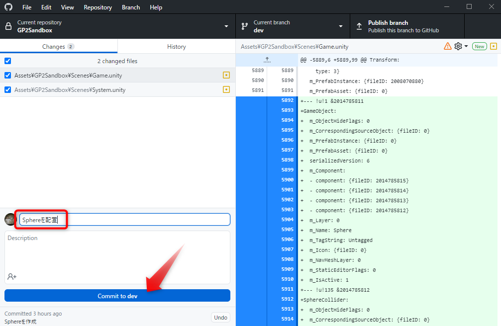

以上でAさんの担当作業は完了です。まだマージはしないでください。

次にBさん役になって作業を進めます。

1. GitHub DesktopでdevBブランチに切り替えます
1. Unityに切り替えて Reload
1. Hierarchyウィンドウの + をクリックして 3D Object > Cubeを選択して Cube を生成します
1. 先ほどのSphereの操作と同様に、作成したCubeをドラッグしてGameシーンでドロップしてGameシーンへ移動します
1. CubeをX=`-2`, Y=`0`, Z=`-2`あたりに移動させてみます

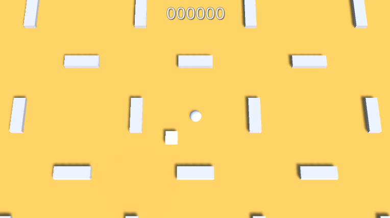

6. FileメニューからSaveでシーンを保存します

以上で作業完了です。コミットしておきます。

7. GitHub Desktopに切り替えます
1. Summaryに`Cubeを配置`など入力してコミットします

以上でAとB両者の作業が完了しました。mainにマージします。

1. GitHub DesktopのCurrent branchを、**マージ先**であるmainに切り替えます
1. Current branchをクリックして、一番下の Choose a branch to merge into main をクリックします

3. マージ元のdevブランチをクリックして選択して、 Merge dev into main をクリックします

Unityに切り替えてReloadをして、mainブランチにAさんの作業が反映されたことを確認します。続けてBさんの作業をマージします。

4. GitHub Desktopに切り替えて、Current branchをクリックして、一番下の Choose a branch to merge into main をクリックします
1. マージ元のdevBブランチをクリックして選択して、 Merge dev into main をクリックします
1. マージが完了したら、Unityに切り替えてReloadします

以上で、両者の作業が結合できました。毎回このようにスムーズに進めばいいのですが、複数メンバーでルールを決めずにそれぞれが自由に開発するとマージの時点で問題が起きることでしょう。

## コンフリクト体験

ではGitのハマりポイントである **コンフリクト(=Conflict 衝突)** を試してみます。まずは`dev`ブランチと`devB`ブランチに`main`ブランチをマージして最新の状態に統一します。

1. GitHub Desktopでdevブランチに切り替えます
1. Current branchをクリックして、Choose a branch to merge into dev をクリックします
1. mainを選択して、Merge main into dev をクリックします

これでdevがmainと同じになりました。devBも同様の手順でmainをマージしてください。

それではコンフリクトを発生させます。今はdevBブランチのはずなので、そこで以下の変更をします

1. Unityに切り替えます
1. HierarchyウィンドウのSphereとCubeのX座標を両方とも`0`にします
1. FileメニューからSaveを選択して保存します
1. `X座標を0`などでコミットします

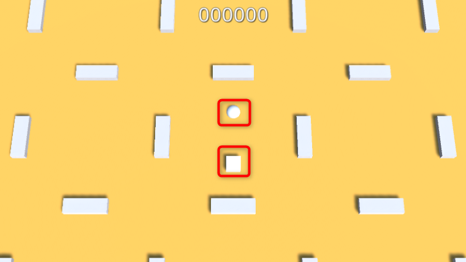

1. Current Branchをdevブランチに切り替えます
1. Unityに切り替えてReloadします
1. HierarchyウィンドウのSphereのX座標を`-2`、CubeのX座標を`2`にして左右の場所を入れ替えます
1. FileメニューからSaveを選択して保存します
1. GitHub Desktopに切り替えて`X座標を反転`などでコミットします

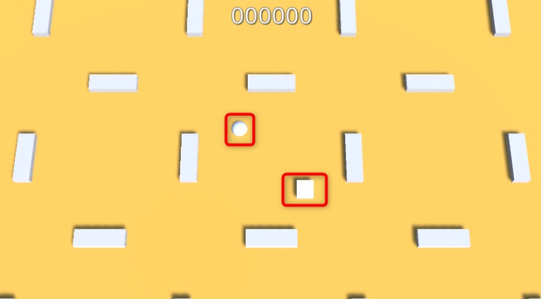

それでは先にやった手順でmainブランチに切り替えて、devとdevBブランチをmainにマージしてみてください。`devB`ブランチをマージしようとすると以下のような警告が表示されます。

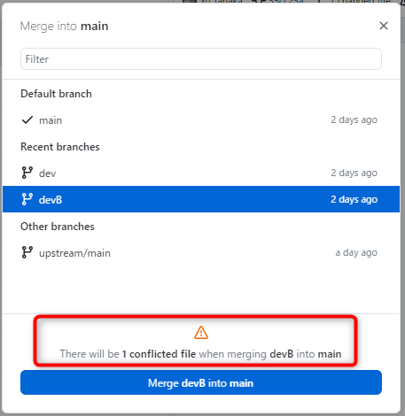

これが **conflict** です。Merge devB into main をクリックしてマージを試します。以下のようなダイアログが表示されてマージさせてくれません。

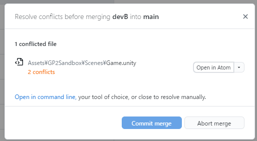

赤い文字も出ていて危険な雰囲気です。そして Commit merge が押せないので無理やり先に進めることができません。これ以上はまずいと思ったら **Abort merge** を押せばマージをやめて引き返すことができます。

今回のように同じ場所が同時に変更されると、どちらの更新が正しいかを自動的に判断することができません。プロジェクトの責任者がどちらを採用するかを決めるか、変更した当人同士で話し合ってどちらの内容を残すか決めて、そのように編集する必要があります。

## コンフリクトの解決方法

チーム制作では決めごとを守ることでコンフリクトを避けることはできます。しかし、Unityでは少しの油断でコンフリクトが起きる可能性があります。またもともとオープンソースでは、誰が、いつ、どこを変更しているか分からないのでコンフリクトは常に発生することが想定されます。いざという時に備えて、コンフリクトの解決方法を知っておきましょう。先のウィンドウの続きから操作します。

1. Open in Atomをクリックします

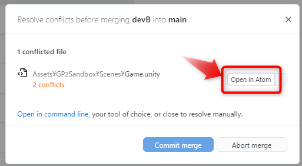

2. Atomエディターでソースコードが開くので、スクロールをして以下のように色が付いている部分を探します

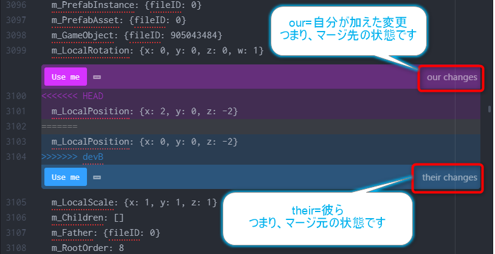

コード内の`<<<<<<< HEAD`から`=======`までの間の行が**マージ先**、つまり現在の手元のブランチの状態を表します。`========`から`>>>>>>> devB`の間の行が**マージ元** なので **devB** ブランチの状態です。利用したい方の**Use me**をクリックすればそちらの変更が採用されます。

今回はどちらが正解というのはないので、とりあえず変更元の変更である **their changes** の方を採用してみましょう。

3. 青い部分の左の**Use me**をクリックして、devBの方を採用します

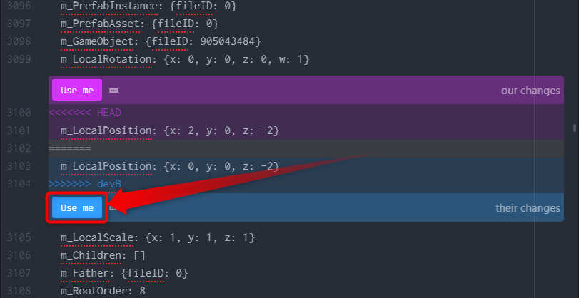

4. Ctrl + F キーで検索ダイアログを出して`=======`を検索します
1. 衝突が見つかったら、再びどちらかの Use me をクリックして衝突を解消
1. 検索を続けて、見つからなければこのファイルのコンフリクトは解決です。Ctrl + S キーで保存します
1. GitHub Desktopに切り替えます
1. コンフリクトが全て解決されたらマージが可能になります。**Commit merge**をクリックしてマージを実行します

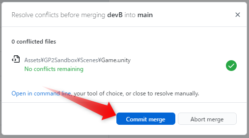

以上でコンフリクト解決です。Unityに切り替えてReloadすると、devBで行った変更であるSphereとCubeのX座標がどちらも0という状態になります。

### 補足：ファイルの差分表記について
`<<<<<<< HEAD`、`=======`、`>>>>>>> devB`といった記号でテキストファイルの差分を表す方法はgit特有のものではなく、昔から使われているものです。専用のエディターを使わなくても、採用する側のコードだけ残して不要なコードと記号を削除すれば**メモ帳のようなテキストエディターでもコンフリクトの解決は可能**です。

## コンフリクトを避けるには

コンフリクトの解決は手間がかかりますし、Unityでは解消が難しくなることもあるので、決まったメンバーで開発するのであればルールを決めてコンフリクトを避けるのが得策です。以下にルールを挙げます。

- mainブランチはマージ専用にして、作業は開発用のブランチを作成してそこで行う
- マージの担当者を決めて、他のメンバーはマージをしないようにして、同時にマージすることによる衝突を避ける
- シーンやプレハブは作業担当者を決めて、その担当者のみが編集する
- 作業をまとめるためのゲームオブジェクトを作成して、データを受け渡すときはそのゲームオブジェクトをPrefabにして、それをエクスポートする
- 他のメンバーが担当しているシーンやプレハブ、ScriptableObject上で作業する必要がある場合は、それらを複製したもので作業をする

以上を**チーム全員で守れる場合に限り**、Gitでのチーム開発を行ってください。コンフリクトを解消できそうなメンバーがいなかったり、上記の操作が難しいメンバーがいる場合は[Unityパッケージによるチーム開発](./unity_package_dev.md)を採用してください。
